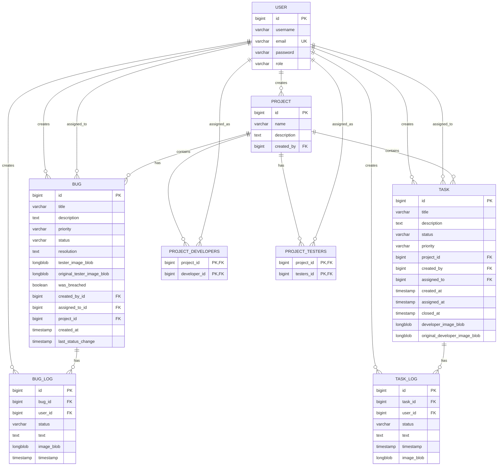

# Software Requirements Specification (SRS)
## VisceralBug - Bug Tracking System

**Version:** 1.0  
**Date:** December 2024  
**Project:** VisceralBug Bug Tracking Application  
**Team:** Utsav Gavli, Vaishnavli Kulkarni, Rahul Patil, Pratik Jadhav, Ritik Dongre

---

## Table of Contents
1. [Introduction](#1-introduction)
2. [System Overview](#2-system-overview)
3. [Functional Requirements](#3-functional-requirements)
4. [Non-Functional Requirements](#4-non-functional-requirements)
5. [System Architecture](#5-system-architecture)
6. [Database Design](#6-database-design)
7. [User Interface Requirements](#7-user-interface-requirements)
8. [Security Requirements](#8-security-requirements)
9. [Performance Requirements](#9-performance-requirements)
10. [Testing Requirements](#10-testing-requirements)
11. [Deployment Requirements](#11-deployment-requirements)

---

## 1. Introduction

### 1.1 Purpose
This document provides a comprehensive specification for the VisceralBug bug tracking system, a web-based application designed to help software development teams efficiently manage and track bugs and tasks throughout the development lifecycle.

### 1.2 Scope
The VisceralBug system provides:
- Role-based access control (Admin, Developer, Tester)
- Project and team management
- Bug reporting and tracking
- Task management
- Real-time notifications
- Email integration
- File/image upload capabilities
- Breach detection and monitoring
- Comprehensive logging and reporting

### 1.3 Definitions and Acronyms
- **Bug**: A software defect or issue reported by testers
- **Task**: A development task assigned by developers to testers
- **Breach**: When a bug exceeds its time limit without resolution
- **JWT**: JSON Web Token for authentication
- **API**: Application Programming Interface
- **SRS**: Software Requirements Specification

---

## 2. System Overview

### 2.1 System Description
VisceralBug is a full-stack web application built with:
- **Frontend**: React.js with modern UI/UX design
- **Backend**: Spring Boot with Java 17
- **Database**: MySQL with JPA/Hibernate
- **Authentication**: JWT-based security
- **Email**: SMTP integration for notifications

### 2.2 System Context
The system serves three primary user roles:
1. **Administrators**: Manage projects, users, and system-wide operations
2. **Developers**: Handle bug resolution and task creation
3. **Testers**: Report bugs and verify fixes

---

## 3. Functional Requirements

### 3.1 User Management

#### 3.1.1 User Registration
- **FR-1.1**: System shall allow user registration with username, email, password, and role
- **FR-1.2**: Password must meet security requirements (8+ chars, capital letter, number, special char)
- **FR-1.3**: Only initial admin (ID=1) can create other admin accounts
- **FR-1.4**: System shall validate unique username and email addresses

#### 3.1.2 User Authentication
- **FR-1.5**: System shall provide JWT-based login authentication
- **FR-1.6**: System shall maintain session state using JWT tokens
- **FR-1.7**: System shall support role-based access control

### 3.2 Project Management

#### 3.2.1 Project Creation
- **FR-2.1**: Admins shall create projects with name and description
- **FR-2.2**: System shall assign project creator as admin
- **FR-2.3**: System shall support multiple developers and testers per project

#### 3.2.2 Project Assignment
- **FR-2.4**: Admins shall assign developers and testers to projects
- **FR-2.5**: Users shall view their assigned projects
- **FR-2.6**: System shall maintain many-to-many relationships between users and projects

### 3.3 Bug Management

#### 3.3.1 Bug Reporting
- **FR-3.1**: Testers shall create bug reports with title, description, priority, and project
- **FR-3.2**: System shall support image uploads for bug documentation
- **FR-3.3**: System shall automatically set bug status to "OPEN"
- **FR-3.4**: System shall send email notifications to project admin on bug creation

#### 3.3.2 Bug Assignment
- **FR-3.5**: Admins shall assign bugs to developers
- **FR-3.6**: Developers shall reassign bugs to other developers
- **FR-3.7**: System shall send email notifications to assigned developers
- **FR-3.8**: System shall maintain assignment history

#### 3.3.3 Bug Status Updates
- **FR-3.9**: Developers shall update bug status (IN_PROGRESS, RESOLVED)
- **FR-3.10**: Developers shall add resolution notes and images
- **FR-3.11**: System shall maintain status change timestamps
- **FR-3.12**: System shall send email notifications on status changes

#### 3.3.4 Bug Verification
- **FR-3.13**: Testers shall verify resolved bugs
- **FR-3.14**: Testers shall reopen bugs if resolution is unsatisfactory
- **FR-3.15**: Testers shall close bugs after verification
- **FR-3.16**: Testers shall reassign bugs to different developers

### 3.4 Task Management

#### 3.4.1 Task Creation
- **FR-4.1**: Developers shall create tasks for testers
- **FR-4.2**: Tasks shall include title, description, priority, and project
- **FR-4.3**: System shall support image uploads for task documentation

#### 3.4.2 Task Assignment
- **FR-4.4**: Developers shall assign tasks to testers
- **FR-4.5**: System shall maintain task assignment history
- **FR-4.6**: System shall support task status tracking (UNASSIGNED, ASSIGNED, CLOSED)

### 3.5 Breach Detection

#### 3.5.1 Time Monitoring
- **FR-5.1**: System shall monitor bug resolution time
- **FR-5.2**: System shall detect breaches (3.5 minutes for demo, configurable)
- **FR-5.3**: System shall mark bugs as breached when time limit exceeded
- **FR-5.4**: System shall provide breached bug isolation and highlighting

#### 3.5.2 Breach Management
- **FR-5.5**: Admins shall view all breached bugs
- **FR-5.6**: System shall provide real-time breach monitoring
- **FR-5.7**: System shall auto-refresh breach status every 30 seconds

### 3.6 Logging and History

#### 3.6.1 Activity Logging
- **FR-6.1**: System shall log all bug status changes
- **FR-6.2**: System shall log all task status changes
- **FR-6.3**: Logs shall include user, timestamp, status, and notes
- **FR-6.4**: System shall support image attachments in logs

#### 3.6.2 History Tracking
- **FR-6.5**: Users shall view bug and task history
- **FR-6.6**: System shall maintain complete audit trail
- **FR-6.7**: System shall support timeline visualization

### 3.7 Reporting

#### 3.7.1 Bug Reports
- **FR-7.1**: System shall generate bug reports by project
- **FR-7.2**: System shall filter bugs by status, priority, and date range
- **FR-7.3**: System shall provide breached bug reports
- **FR-7.4**: System shall support role-based report access

#### 3.7.2 Task Reports
- **FR-7.5**: System shall generate task reports
- **FR-7.6**: System shall track task completion rates
- **FR-7.7**: System shall provide task assignment analytics

### 3.8 Email Notifications

#### 3.8.1 Notification System
- **FR-8.1**: System shall send email notifications for bug creation
- **FR-8.2**: System shall send email notifications for bug assignment
- **FR-8.3**: System shall send email notifications for status changes
- **FR-8.4**: System shall support CC functionality for project admins

---

## 4. Non-Functional Requirements

### 4.1 Performance
- **NFR-1.1**: System shall respond to user requests within 2 seconds
- **NFR-1.2**: System shall support concurrent users (minimum 50)
- **NFR-1.3**: System shall handle image uploads up to 10MB
- **NFR-1.4**: Database queries shall complete within 1 second

### 4.2 Security
- **NFR-2.1**: All passwords shall be encrypted using BCrypt
- **NFR-2.2**: JWT tokens shall expire after 24 hours
- **NFR-2.3**: System shall validate all user inputs
- **NFR-2.4**: System shall prevent SQL injection attacks
- **NFR-2.5**: System shall implement CORS policies

### 4.3 Reliability
- **NFR-3.1**: System shall be available 99% of the time
- **NFR-3.2**: System shall handle database connection failures gracefully
- **NFR-3.3**: System shall provide error logging and monitoring

### 4.4 Usability
- **NFR-4.1**: Interface shall be responsive and mobile-friendly
- **NFR-4.2**: System shall provide intuitive navigation
- **NFR-4.3**: System shall support modern web browsers
- **NFR-4.4**: System shall provide clear error messages

---

## 5. System Architecture

### 5.1 Technology Stack

#### 5.1.1 Frontend
- **Framework**: React.js 18.2.0
- **Routing**: React Router DOM 6.22.3
- **Styling**: CSS3 with Tailwind CSS
- **HTTP Client**: Axios
- **Animation**: Framer Motion 12.15.0

#### 5.1.2 Backend
- **Framework**: Spring Boot 3.4.8
- **Language**: Java 17
- **Security**: Spring Security with JWT
- **Database**: MySQL with JPA/Hibernate
- **Email**: Spring Mail with SMTP
- **Build Tool**: Maven

### 5.2 Architecture Pattern
- **Frontend**: Single Page Application (SPA)
- **Backend**: RESTful API with layered architecture
- **Database**: Relational database with JPA/Hibernate ORM
- **Authentication**: Stateless JWT-based authentication

---

## 6. Database Design

### 6.1 Entity Relationship Diagram



#### 6.1.1 ER Diagram Description

The Entity Relationship Diagram above illustrates the complete database structure of the VisceralBug system with the following key entities and relationships:

**Core Entities:**
- **USER**: Central entity representing all system users (Admins, Developers, Testers)
- **PROJECT**: Represents software projects managed in the system
- **BUG**: Represents bug reports created by testers
- **TASK**: Represents development tasks created by developers

**Logging Entities:**
- **BUG_LOG**: Tracks all status changes and activities related to bugs
- **TASK_LOG**: Tracks all status changes and activities related to tasks

**Junction Tables:**
- **PROJECT_DEVELOPERS**: Many-to-many relationship between projects and developers
- **PROJECT_TESTERS**: Many-to-many relationship between projects and testers

**Key Relationships:**
- **User-Project**: Users can create projects and be assigned to multiple projects
- **User-Bug**: Users can create bugs and be assigned to resolve bugs
- **User-Task**: Users can create tasks and be assigned to complete tasks
- **Project-Bug/Task**: Projects contain multiple bugs and tasks
- **Bug/Task-Log**: Complete audit trail of all activities

**Data Integrity Features:**
- Foreign key constraints ensure referential integrity
- Unique constraints on email addresses prevent duplicate registrations
- Timestamp fields track creation and modification times
- Image blob fields support file attachments for documentation
- Breach detection flag monitors time-based violations

### 6.2 Database Schema

#### 6.2.1 User Table
```sql
CREATE TABLE user (
    id BIGINT PRIMARY KEY AUTO_INCREMENT,
    username VARCHAR(255) NOT NULL,
    email VARCHAR(255) NOT NULL UNIQUE,
    password VARCHAR(255) NOT NULL,
    role VARCHAR(50) NOT NULL
);
```

#### 6.2.2 Project Table
```sql
CREATE TABLE project (
    id BIGINT PRIMARY KEY AUTO_INCREMENT,
    name VARCHAR(255) NOT NULL,
    description TEXT,
    created_by BIGINT,
    FOREIGN KEY (created_by) REFERENCES user(id)
);
```

#### 6.2.3 Project_Developers Table
```sql
CREATE TABLE project_developers (
    project_id BIGINT,
    developer_id BIGINT,
    PRIMARY KEY (project_id, developer_id),
    FOREIGN KEY (project_id) REFERENCES project(id),
    FOREIGN KEY (developer_id) REFERENCES user(id)
);
```

#### 6.2.4 Project_Testers Table
```sql
CREATE TABLE project_testers (
    project_id BIGINT,
    testers_id BIGINT,
    PRIMARY KEY (project_id, testers_id),
    FOREIGN KEY (project_id) REFERENCES project(id),
    FOREIGN KEY (testers_id) REFERENCES user(id)
);
```

#### 6.2.5 Bug Table
```sql
CREATE TABLE bug (
    id BIGINT PRIMARY KEY AUTO_INCREMENT,
    title VARCHAR(255) NOT NULL,
    description TEXT,
    priority VARCHAR(50),
    status VARCHAR(50) DEFAULT 'OPEN',
    resolution TEXT,
    tester_image_blob LONGBLOB,
    original_tester_image_blob LONGBLOB,
    was_breached BOOLEAN DEFAULT FALSE,
    created_by_id BIGINT,
    assigned_to_id BIGINT,
    project_id BIGINT,
    created_at TIMESTAMP DEFAULT CURRENT_TIMESTAMP,
    last_status_change TIMESTAMP,
    FOREIGN KEY (created_by_id) REFERENCES user(id),
    FOREIGN KEY (assigned_to_id) REFERENCES user(id),
    FOREIGN KEY (project_id) REFERENCES project(id)
);
```

#### 6.2.6 Bug_Log Table
```sql
CREATE TABLE bug_log (
    id BIGINT PRIMARY KEY AUTO_INCREMENT,
    bug_id BIGINT,
    user_id BIGINT,
    status VARCHAR(50),
    text TEXT,
    image_blob LONGBLOB,
    timestamp TIMESTAMP DEFAULT CURRENT_TIMESTAMP,
    FOREIGN KEY (bug_id) REFERENCES bug(id),
    FOREIGN KEY (user_id) REFERENCES user(id)
);
```

#### 6.2.7 Task Table
```sql
CREATE TABLE task (
    id BIGINT PRIMARY KEY AUTO_INCREMENT,
    title VARCHAR(255) NOT NULL,
    description TEXT,
    status VARCHAR(50) DEFAULT 'UNASSIGNED',
    priority VARCHAR(50) DEFAULT 'MEDIUM',
    project_id BIGINT NOT NULL,
    created_by BIGINT NOT NULL,
    assigned_to BIGINT,
    created_at TIMESTAMP DEFAULT CURRENT_TIMESTAMP,
    assigned_at TIMESTAMP,
    closed_at TIMESTAMP,
    developer_image_blob LONGBLOB,
    original_developer_image_blob LONGBLOB,
    FOREIGN KEY (project_id) REFERENCES project(id),
    FOREIGN KEY (created_by) REFERENCES user(id),
    FOREIGN KEY (assigned_to) REFERENCES user(id)
);
```

#### 6.2.8 Task_Log Table
```sql
CREATE TABLE task_logs (
    id BIGINT PRIMARY KEY AUTO_INCREMENT,
    task_id BIGINT NOT NULL,
    user_id BIGINT NOT NULL,
    status VARCHAR(50) NOT NULL,
    text TEXT,
    timestamp TIMESTAMP DEFAULT CURRENT_TIMESTAMP,
    image_blob LONGBLOB,
    FOREIGN KEY (task_id) REFERENCES task(id),
    FOREIGN KEY (user_id) REFERENCES user(id)
);
```

### 6.3 Indexes
- Primary keys on all tables
- Unique index on user.email
- Indexes on foreign key columns
- Indexes on frequently queried columns (status, priority, created_at)

---

## 7. User Interface Requirements

### 7.1 Dashboard Requirements
- **UI-1.1**: Role-specific dashboards for Admin, Developer, and Tester
- **UI-1.2**: Real-time statistics and metrics
- **UI-1.3**: Quick access to assigned projects and tasks
- **UI-1.4**: Breach monitoring and alerts

### 7.2 Navigation Requirements
- **UI-2.1**: Intuitive navigation menu
- **UI-2.2**: Breadcrumb navigation
- **UI-2.3**: Responsive design for mobile devices
- **UI-2.4**: Consistent styling across all pages

### 7.3 Form Requirements
- **UI-3.1**: User-friendly input forms
- **UI-3.2**: Form validation with clear error messages
- **UI-3.3**: File upload capabilities with preview
- **UI-3.4**: Auto-save functionality for long forms

### 7.4 Table Requirements
- **UI-4.1**: Sortable and filterable data tables
- **UI-4.2**: Pagination for large datasets
- **UI-4.3**: Export functionality for reports
- **UI-4.4**: Real-time updates and refresh

---

## 8. Security Requirements

### 8.1 Authentication
- **SEC-1.1**: JWT-based token authentication
- **SEC-1.2**: Token expiration and refresh mechanism
- **SEC-1.3**: Secure password storage with BCrypt
- **SEC-1.4**: Role-based access control

### 8.2 Authorization
- **SEC-2.1**: Resource-level access control
- **SEC-2.2**: User can only access their assigned projects
- **SEC-2.3**: Developers can only modify assigned bugs
- **SEC-2.4**: Testers can only modify their created bugs

### 8.3 Data Protection
- **SEC-3.1**: Input validation and sanitization
- **SEC-3.2**: SQL injection prevention
- **SEC-3.3**: XSS attack prevention
- **SEC-3.4**: CSRF protection

---

## 9. Performance Requirements

### 9.1 Response Time
- **PERF-1.1**: Page load time < 3 seconds
- **PERF-1.2**: API response time < 2 seconds
- **PERF-1.3**: Image upload processing < 5 seconds
- **PERF-1.4**: Database query execution < 1 second

### 9.2 Scalability
- **PERF-2.1**: Support for 100+ concurrent users
- **PERF-2.2**: Handle 1000+ bugs per project
- **PERF-2.3**: Support for 50+ projects
- **PERF-2.4**: Efficient memory usage

### 9.3 Availability
- **PERF-3.1**: 99% uptime requirement
- **PERF-3.2**: Graceful error handling
- **PERF-3.3**: Automatic recovery from failures
- **PERF-3.4**: Backup and restore capabilities

---

## 10. Testing Requirements

### 10.1 Unit Testing
- **TEST-1.1**: 80% code coverage requirement
- **TEST-1.2**: Test all service layer methods
- **TEST-1.3**: Test all controller endpoints
- **TEST-1.4**: Test data validation logic

### 10.2 Integration Testing
- **TEST-2.1**: Test database operations
- **TEST-2.2**: Test email service integration
- **TEST-2.3**: Test file upload functionality
- **TEST-2.4**: Test authentication flow

### 10.3 User Acceptance Testing
- **TEST-3.1**: Test all user workflows
- **TEST-3.2**: Test role-based access
- **TEST-3.3**: Test breach detection
- **TEST-3.4**: Test email notifications

---

## 11. Deployment Requirements

### 11.1 Environment Requirements
- **DEP-1.1**: Java 17 runtime environment
- **DEP-1.2**: MySQL 8.0+ database
- **DEP-1.3**: Node.js 16+ for frontend build
- **DEP-1.4**: SMTP server for email notifications

### 11.2 Configuration
- **DEP-2.1**: Environment-specific configuration files
- **DEP-2.2**: Database connection configuration
- **DEP-2.3**: JWT secret configuration
- **DEP-2.4**: Email server configuration

### 11.3 Deployment Process
- **DEP-3.1**: Automated build process with Maven
- **DEP-3.2**: Frontend build optimization
- **DEP-3.3**: Database migration scripts
- **DEP-3.4**: Health check endpoints

---

## Appendix

### A. API Endpoints

#### Authentication
- `POST /api/auth/login` - User login
- `POST /api/auth/register` - User registration
- `GET /api/auth/users` - Get users by role

#### Projects
- `GET /api/projects` - Get user's projects
- `POST /api/projects` - Create project
- `PUT /api/projects/{id}/developers` - Assign developers
- `PUT /api/projects/{id}/testers` - Assign testers

#### Bugs
- `GET /api/bugs` - Get bugs with filters
- `POST /api/bugs` - Create bug
- `PUT /api/bugs/{id}/assign/{developerId}` - Assign bug
- `PUT /api/bugs/{id}/status` - Update bug status
- `GET /api/bugs/{id}/logs` - Get bug logs
- `POST /api/bugs/{id}/log` - Add bug log

#### Tasks
- `GET /api/tasks` - Get tasks
- `POST /api/tasks` - Create task
- `PUT /api/tasks/{id}/assign/{testerId}` - Assign task
- `PUT /api/tasks/{id}/status` - Update task status

### B. Error Codes
- `400` - Bad Request
- `401` - Unauthorized
- `403` - Forbidden
- `404` - Not Found
- `500` - Internal Server Error

### C. Status Values
- **Bug Status**: OPEN, ASSIGNED, IN_PROGRESS, RESOLVED, CLOSED
- **Task Status**: UNASSIGNED, ASSIGNED, CLOSED
- **Priority**: LOW, MEDIUM, HIGH, CRITICAL
- **User Roles**: ADMIN, DEVELOPER, TESTER

---

**Document End** 